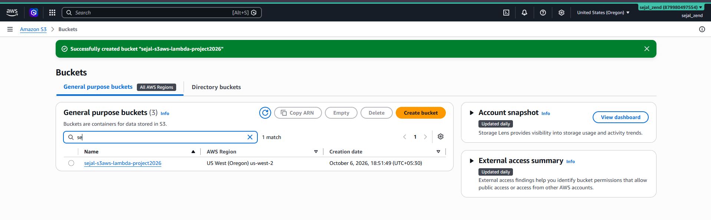
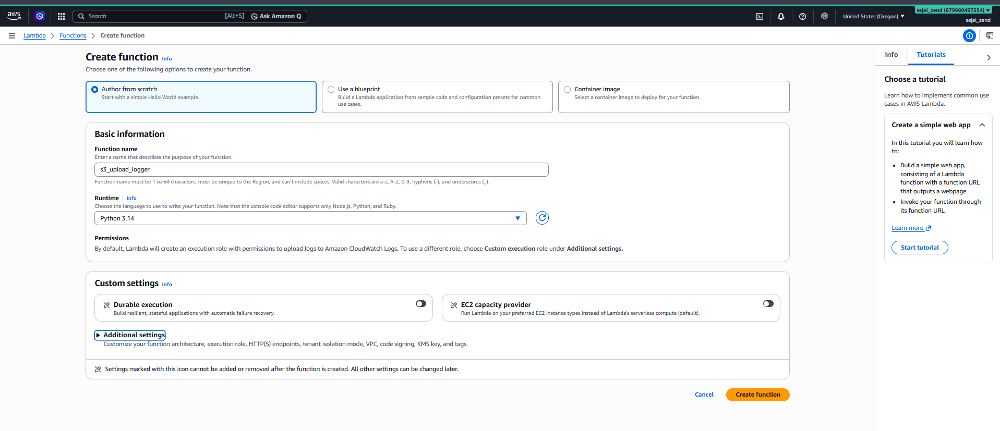
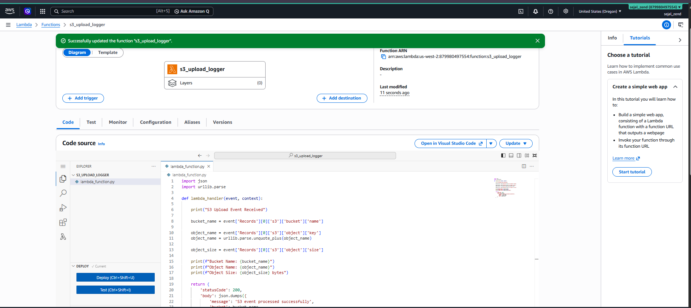
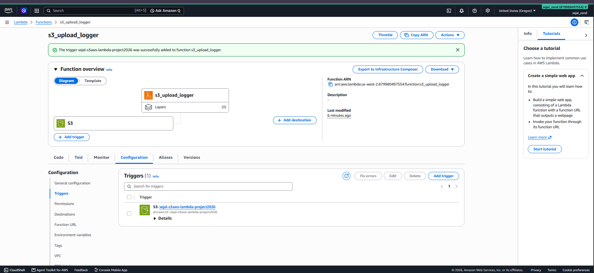
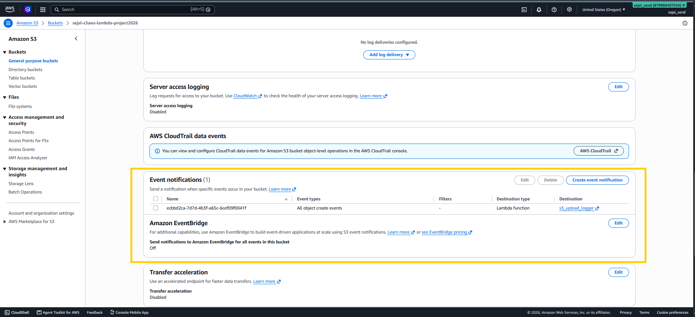
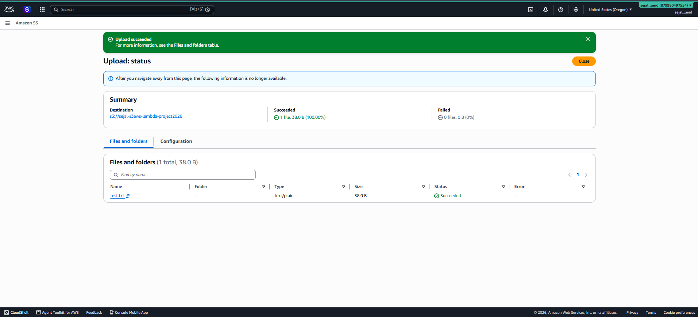
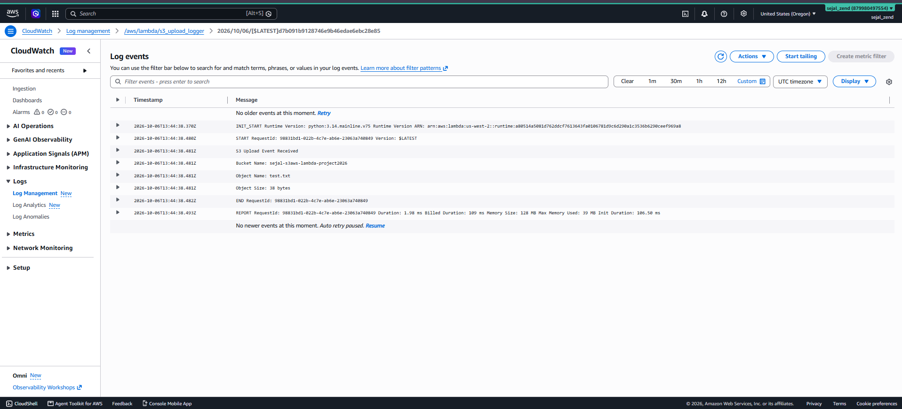

# Project 2 - S3 Event-Driven Lambda

## 1. Project Overview

This project demonstrates an event-driven AWS solution using **Amazon S3, AWS Lambda, and Amazon CloudWatch Logs**.

Whenever a file is uploaded to an S3 bucket, an S3 ObjectCreated event triggers a Lambda function. The Lambda function extracts the bucket name, object name, and object size and writes these details to CloudWatch Logs.

### AWS Services Used

| AWS Service | Purpose |
|---|---|
| **Amazon S3** | Stores uploaded files and generates object creation events |
| **AWS Lambda** | Processes the S3 upload event |
| **Amazon CloudWatch Logs** | Stores Lambda execution logs |

---

# 2. Architecture

```text
                 AWS Cloud

        +----------------------+
        |      Amazon S3       |
        |                      |
        |      S3 Bucket       |
        |      test.txt        |
        +----------+-----------+
                   |
                   | ObjectCreated Event
                   v
        +----------------------+
        |      AWS Lambda      |
        |                      |
        |   s3-upload-logger   |
        +----------+-----------+
                   |
                   | Execution Logs
                   v
        +----------------------+
        |  CloudWatch Logs     |
        |                      |
        | Bucket Name          |
        | Object Name          |
        | Object Size          |
        +----------------------+
```

---

# 3. S3 Bucket Configuration

An S3 bucket was created to store files and trigger the Lambda function when a new object is uploaded.

| Configuration | Value |
|---|---|
| Bucket Name | `[ENTER BUCKET NAME]` |
| Region | `[ENTER AWS REGION]` |
| Public Access | Blocked |
| Event Type | Object Created |




---

# 4. Lambda Function

A Lambda function was created using Python to process S3 upload events.

| Configuration | Value |
|---|---|
| Function Name | `s3-upload-logger` |
| Runtime | `Python 3.x` |
| Region | `[ENTER AWS REGION]` |

The function receives the S3 event and extracts:

- Bucket name
- Object name
- Object size




### Lambda Code

```python
import json
import urllib.parse

def lambda_handler(event, context):

    print("S3 Upload Event Received")

    bucket_name = event['Records'][0]['s3']['bucket']['name']

    object_name = event['Records'][0]['s3']['object']['key']
    object_name = urllib.parse.unquote_plus(object_name)

    object_size = event['Records'][0]['s3']['object']['size']

    print(f"Bucket Name: {bucket_name}")
    print(f"Object Name: {object_name}")
    print(f"Object Size: {object_size} bytes")

    return {
        'statusCode': 200,
        'body': json.dumps({
            'message': 'S3 event processed successfully',
            'bucket': bucket_name,
            'object': object_name,
            'size': object_size
        })
    }
```





---

# 5. S3 → Lambda Trigger

An S3 trigger was configured for the Lambda function.

### Configuration

```text
Event Type: All object create events
Destination: s3-upload-logger Lambda function
```

Whenever a new object is created in the S3 bucket, the Lambda function is automatically invoked.

### Event Flow

```text
File Upload
     |
     v
S3 Object Created
     |
     v
Lambda Triggered
     |
     v
Lambda Processes Event
     |
     v
CloudWatch Logs
```





---

# 6. Testing

A test file was uploaded to the S3 bucket.

Example:

```text
test.txt
```

The upload generated an S3 ObjectCreated event, which automatically invoked the Lambda function.






---

# 7. CloudWatch Logs

After the Lambda function executed, the function logs were viewed in:

**CloudWatch → Logs → Log groups → `/aws/lambda/s3-upload-logger`**

The logs confirmed that the S3 event was successfully received and processed.

Example output:

```text
S3 Upload Event Received

Bucket Name: [bucket-name]
Object Name: test.txt
Object Size: [size] bytes
```





---

# 8. Testing Result

| Test | Expected Result | Result |
|---|---|---|
| Create S3 bucket | Bucket created successfully | PASS |
| Create Lambda | Lambda function created | PASS |
| Configure S3 trigger | S3 connected to Lambda | PASS |
| Upload test file | Object uploaded successfully | PASS |
| Lambda invocation | Lambda triggered automatically | PASS |
| CloudWatch Logs | Bucket and object details recorded | PASS |

---

# 9. Conclusion

The project successfully demonstrates an event-driven AWS architecture using S3 and Lambda.

When a file is uploaded to the S3 bucket, an ObjectCreated event automatically triggers the Lambda function. The Lambda function processes the event and records the bucket name, object name, and object size in CloudWatch Logs.

This confirms the complete event flow:

```text
S3 Upload
    ↓
S3 ObjectCreated Event
    ↓
AWS Lambda
    ↓
CloudWatch Logs
```
